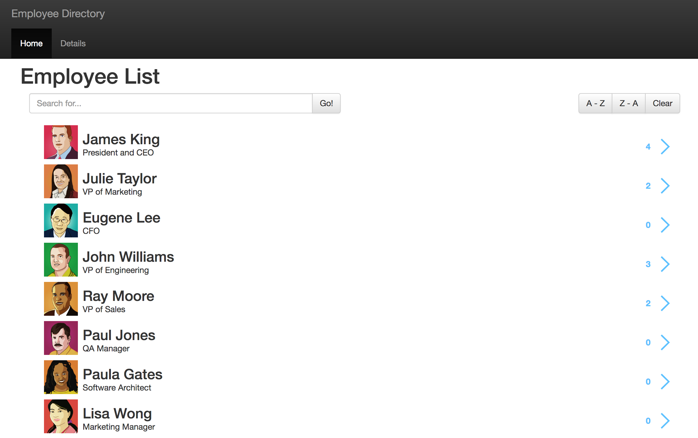

# Jquery-handlebars-demo
This is an old training resource I did on hands on training.

Demo Application


# clone it
git clone ssh://git@github.com:devsmart/Jquery-handlebars-demo.git

# install build tools if not installed
```
 npm install -g grunt-cli

```
# Install dependencies
```
 cd Jquery-handlebars-demo
 npm install

```

# Build & Run
```
 grunt build
 node server.js

```

# Try it!
open http://localhost:3000 in your browser